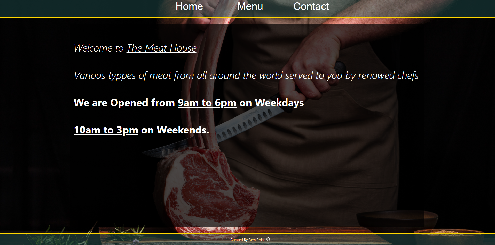

Restaurant Page project from The odin project

Made with HTML, CSS, Javascript and the use of webpack

# Links 
[The project details](https://www.theodinproject.com/lessons/node-path-javascript-restaurant-page)

[Live Demo](https://remiferiaa.github.io/restaurant-page/)

# About 
- Add the book of your choice with details such as Title, Author, Pages and Read status.
- Remove book when you feel like it.

# Sample
